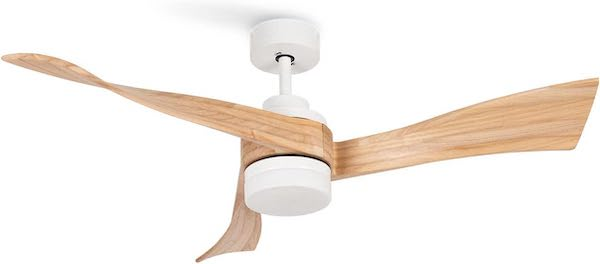
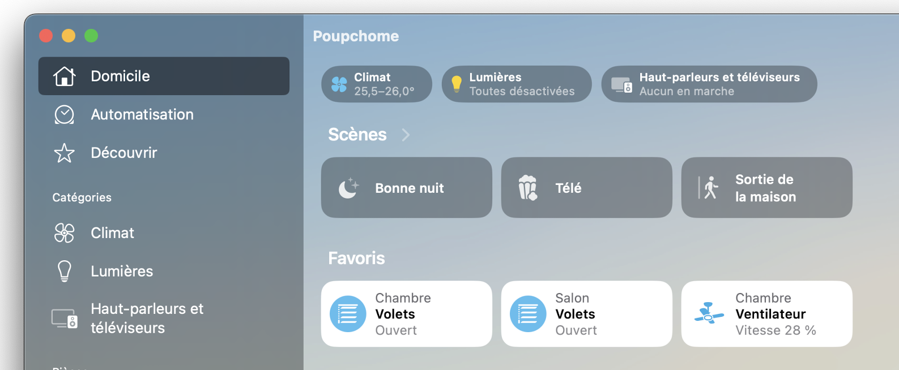
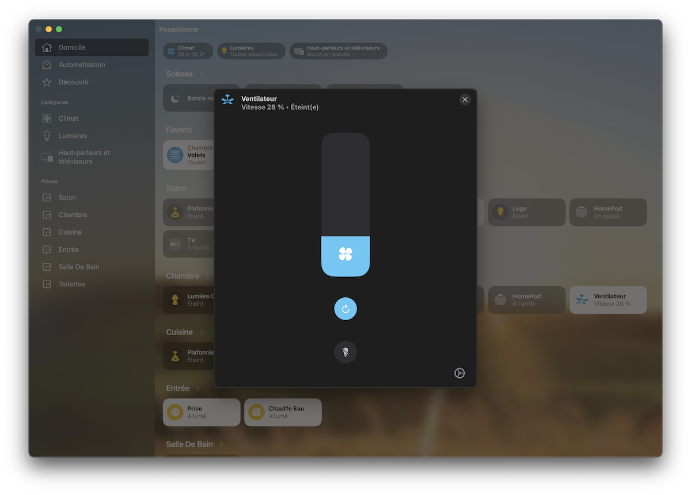

# CREATE Ceiling Fan

Control your CREATE Ceiling Fan from HomeKit.
- Turn fan on/off
- Adjust fan speed (6 steps, shown as a slider in the Home app)
- Reverse rotation direction (summer/winter mode)
- Turn light on/off
- Stateless Programmable Switch tiles (rendered as "Button" category in Apple Home)




## Installation

Go to the Homebridge UI, Plugins screen and search for `homebridge-create-ceiling-fan`. Install the plugin and use the form to configure it.


### Optional

#### Stateless button tiles

The plugin exposes two extra Stateless Programmable Switch services that Apple Home renders as
"Button" category tiles. Note: these tiles cannot be tapped from the Home app nor targeted as
automation actions — they are placeholders. To actually toggle the fan or the light from a physical
HomeKit button, point the automation at `Ceiling Fan (Active)` or `Ceiling Light (On)` directly,
using a Shortcut with `If` logic if you need a single-press toggle.

Set `toggles: false` on the device to hide them. Default is `true`.

```json
{
  "platform": "HomebridgeCreateCeilingFan",
  "devices": [
    { "id": "…", "key": "…", "name": "Ceiling Fan", "toggles": false }
  ]
}
```


## Configuration

To get your `Id` and `Key` ceiling fan, follow the instructions [Getting your keys](https://github.com/jasonacox/tinytuya/tree/master#setup-wizard---getting-local-keys)

## Thanks

- [tuyapi](https://github.com/codetheweb/tuyapi)
- @marsuboss
